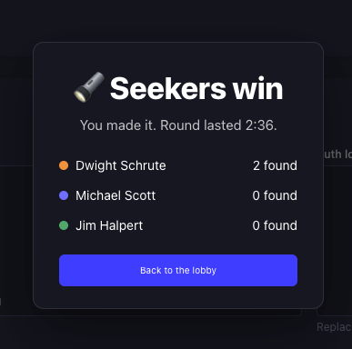
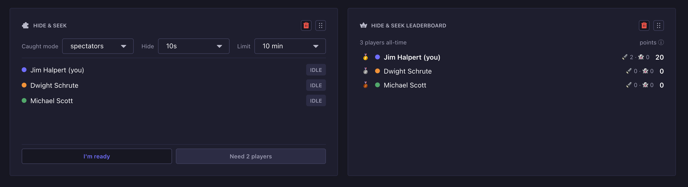

# Hide & Seek for Strapi

Hide and seek, played inside the Strapi admin panel.

Every admin user is a player, every admin route is a hiding spot, and the mouse
cursor is the character. No canvas, no game engine — the game is the CMS you
already spend your day in.

> Built for the end of a sprint, a new joiner's first afternoon, or any excuse to
> make five people click around the same Strapi at the same time.

<p align="center">
  
</p>

<p align="center"><em>Michael Scott, hiding in an empty Media Library. The grace
window has passed, so the seeker can finally see his cursor.</em></p>

## Requirements

- **Strapi 5.13 or later** — the lobby is a homepage widget, and that API
  (`app.widgets.register`) landed in 5.13.0.
- **A single Strapi instance.** Game state lives in memory, so behind a load
  balancer with several nodes players on different nodes cannot see each other.
- Node 18+.

## Install

```bash
npm install strapi-plugin-hide-and-seek
```

The plugin is auto-discovered — no config entry needed. Rebuild the admin and
start Strapi:

```bash
npm run build && npm run develop
```

Both widgets then appear on the admin homepage on their own.

**Unless you have already rearranged your homepage.** Strapi saves a widget
layout per admin user, and a saved layout lists the widgets it shows by name — so
widgets registered later are not in it and stay hidden. If your homepage looks
unchanged after installing, use **Add Widget** on the homepage to place
*Hide & Seek* and *Hide & Seek leaderboard*. Each player does this once, for
their own homepage. The plugin deliberately does not rewrite anybody's saved
layout.

Players are ordinary Strapi admin users. Create one per person under
**Settings → Administration panel → Users**, or from the CLI:

```bash
npx strapi admin:create-user -e player@example.com -p 'a-password' -f First -l Last
```

Everyone logs into the same Strapi. The lobby is waiting on the homepage.

## How a round works

**1. Lobby.** A widget on the admin homepage lists everyone currently connected.
A second widget keeps the all-time leaderboard.
Players mark themselves ready and agree on the house rules. Two ready players are
enough to start.

**2. Countdown.** 3… 2… 1…, roles still secret — nobody knows who is about to be
the seeker, including the seeker.

**3. Hiding.** One player is revealed as the seeker and is blindfolded by a
full-screen overlay. Everyone else gets a few seconds to go anywhere in the
admin: Content Manager, Media Library, Settings, one specific entry. The route
they end on *is* their hiding spot.

**4. Hunting.** The seeker browses the admin looking for company. Landing on an
occupied page does not give the hider away immediately — they stay invisible for
a short grace window, long enough to see the alarm and think about running. But
the moment a seeker and a hider share a page, **both are locked in**: links stop
working for a few seconds, so the hider has to dodge rather than click away. Once
the grace window passes, their cursor appears as a ghost, and the seeker catches
them by keeping their own cursor on top of it for a beat.

**5. Over.** The round ends when every hider has been found, or when the clock
runs out and the survivors win. Everyone is sent back to the homepage for the
next round.

<p align="center">
  
</p>

## Leaderboard



The plugin adds two homepage widgets: the lobby and an all-time leaderboard.
Standings survive restarts — they are kept in Strapi's core store, not in memory,
and deliberately **not** as a content type: a game has no business adding a
collection to somebody's Content Manager.

Scoring is simple enough to argue about:

| | |
| --- | --- |
| Player found, as a seeker | **10 points** |
| Round survived, as a hider | **20 points** |

Each row also tracks rounds played, rounds seeking, players found, escapes and
times caught. Your own row is pinned to the bottom of the board if you are not in
the top ten.

Standings are stored under the core-store key `plugin_hide-and-seek_leaderboard`;
delete that row to wipe the board.

## Rules that keep it honest

- **No camping.** A hider whose cursor stops moving for a couple of seconds is
  revealed by a pulsing ping, grace window or not. Parking the mouse off-screen
  loses the round.
- **No peeking.** The server never sends the seeker a hider they have not earned
  sight of, so there is nothing to read in the network tab.
- **No running from a standoff.** The lockdown is enforced on the server, not just
  in the UI. Clicks are swallowed in the capture phase before the admin's router
  sees them; a reload or the back button can still move the browser, but the game
  ignores the move and keeps the player in the room, still catchable. Escaping
  that way gains nothing.
- **No rage-quitting.** A hider who disconnects mid-hunt forfeits after a delay.

## Configuration

Everything has a playable default. Override any of it in `config/plugins.ts`:

```ts
export default {
  'hide-and-seek': {
    enabled: true,
    config: {
      hideSeconds: 10,
      lockdownMs: 4000,
      caughtBecome: 'seeker',
    },
  },
};
```

| Option | Default | What it does |
| --- | --- | --- |
| `countdownSeconds` | `3` | "3… 2… 1…" before roles are revealed. |
| `hideSeconds` | `10` | Time to scatter while the seeker is blindfolded. |
| `roundSeconds` | `600` | Hard time limit. Hiders still free at 0:00 win. |
| `graceMs` | `1500` | How long a hider stays invisible after a seeker arrives. |
| `lockdownMs` | `4000` | How long a shared page locks both players in place. |
| `catchRadius` | `0.04` | Catch distance, as a fraction of the viewport. |
| `catchHoldMs` | `800` | How long the seeker must hold the cursor to catch. |
| `idleRevealMs` | `2000` | A motionless hider is revealed after this. |
| `caughtBecome` | `'seeker'` | `'seeker'` for tag-team, or `'spectator'`. |
| `seekerCount` | `1` | Seekers drawn at the start of a round. |
| `forfeitAfterMs` | `20000` | A disconnected hider forfeits after this. |
| `tickHz` | `20` | Server tick and position broadcast rate. |
| `corsOrigin` | `true` | socket.io CORS origin. `true` reflects the request origin. |

`caughtBecome`, `hideSeconds`, `roundSeconds` and `seekerCount` can also be
changed from the lobby widget between rounds, without a restart.

### Tuning the feel

The interesting number is the gap between `graceMs` and `lockdownMs` — that is
how long a cornered hider spends visible and unable to flee. With the defaults it
is 2.5 seconds of pure dodging. Widen it for tension, narrow it for chaos.

## How it works

- **Transport.** A socket.io server attached to Strapi's own HTTP server
  (`strapi.server.httpServer`) at `/hide-and-seek/socket.io`. No second port, no
  extra process.
- **Auth.** The admin panel asks the authenticated route
  `GET /hide-and-seek/ticket` for a single-use, 30-second handshake ticket and
  hands it to the socket server. The socket layer never needs to know how Strapi
  stores admin sessions, which keeps it working across Strapi's auth changes.
- **Authority.** The server decides everything: who seeks, who is visible to whom,
  who is locked in, and whether a catch happened — computed from both cursors
  server-side. The client only draws what it is told.
- **State.** Round state is entirely in memory: a round is short and a restart just
  sends everyone back to the lobby, so nothing there is worth a database
  round-trip at 20Hz. Only the leaderboard is persisted, once per round, when it
  ends.
- **Admin UI.** The lobby is a homepage widget. The game overlay has no such slot —
  nothing in the admin renders on every route — so it mounts its own React root on
  `document.body` from the plugin's `bootstrap()`, which survives client-side
  navigation. Cursor positions are written straight to the DOM from an animation
  frame rather than through React state; 20Hz of coordinates should not re-render
  the panel.

## Known limitations

- Single Strapi instance only (see Requirements).
- Keyboard-driven navigation during a lockdown — typing a URL, `Cmd+L`, the back
  button — is not blocked in the UI. The server still refuses the move, so it is
  not an advantage, but the escapee's screen will show a page the game does not
  think they are on.
- Positions are viewport-relative, so players on very different screen sizes see
  ghosts in slightly different places relative to the page content.

## Local development

```bash
git clone https://github.com/Adzouz/StrapiPluginHideAndSeek.git
cd strapi-plugin-hide-and-seek
npm install
npm run build      # or: npm run watch
```

To try it in a Strapi project on the same machine:

```bash
cd ../my-strapi-project
npm install ../strapi-plugin-hide-and-seek
```

A symlinked plugin ships its own copy of React, which breaks hooks in the admin.
Add `src/admin/vite.config.ts` to the host project:

```ts
import { mergeConfig, type UserConfig } from 'vite';

export default (config: UserConfig) =>
  mergeConfig(config, {
    resolve: { dedupe: ['react', 'react-dom', 'styled-components', 'react-router-dom'] },
  });
```

`strapi develop` does not watch `node_modules`, so restart it after rebuilding
the plugin.

## Tests

`tests/e2e.mjs` plays a full headless round against a running Strapi: it logs two
admin users in, takes tickets, connects both sockets and asserts that roles stay
secret during the countdown, that the grace window really blinds the seeker, that
the hider is always warned, that the lockdown blocks a page change and lifts on
time, that a sustained cursor lock produces a catch, that `caughtBecome` is
honoured, and that the round lands on the leaderboard with the right points.

```bash
npx strapi admin:create-user -e seeker@hns.test -p 'HideSeek1!' -f Sam -l Seeker
npx strapi admin:create-user -e hider@hns.test  -p 'HideSeek1!' -f Hana -l Hider
HNS_URL=http://127.0.0.1:1337 npm run test:e2e
```

Override `HNS_URL`, `HNS_USER_A`, `HNS_USER_B` and `HNS_PASSWORD` to point it
elsewhere.

## Translations

The admin panel and the in-game overlay are fully translated into **15 languages**
besides English: French, German, Spanish, Italian, Portuguese (Portugal and
Brazil), Dutch, Polish, Russian, Ukrainian, Turkish, Japanese, Korean and Chinese
(Simplified and Traditional). The plugin follows whatever language the admin user
picked in their profile; any locale without a catalogue falls back to English, so
nothing ever renders blank.

Adding a language is one file:

```bash
cp admin/src/translations/en.json admin/src/translations/<locale>.json
```

Keep the keys exactly as they are — they are the full message ids, prefixed with
`hide-and-seek.`, because Strapi merges plugin catalogues without namespacing
them — and translate the values. `{name}`, `{count}` and friends are
placeholders and must survive the translation. Locale codes are the ones Strapi
itself ships (`fr`, `pt-BR`, `zh-Hans`, …).

The overlay renders outside Strapi's `IntlProvider`, so it cannot use react-intl;
it reads the same catalogues through a small helper in `admin/src/i18n.js`. Both
paths share one set of keys, and `admin/src/i18n.js` holds the English source of
truth.

Translations beyond English were written without native review — corrections are
very welcome.

## Contributing

Issues and pull requests welcome. Good first additions: a language (see above),
new catch mechanics, per-round scoreboards, and a way to make long hiding spots
leak a hint.

## License

MIT
